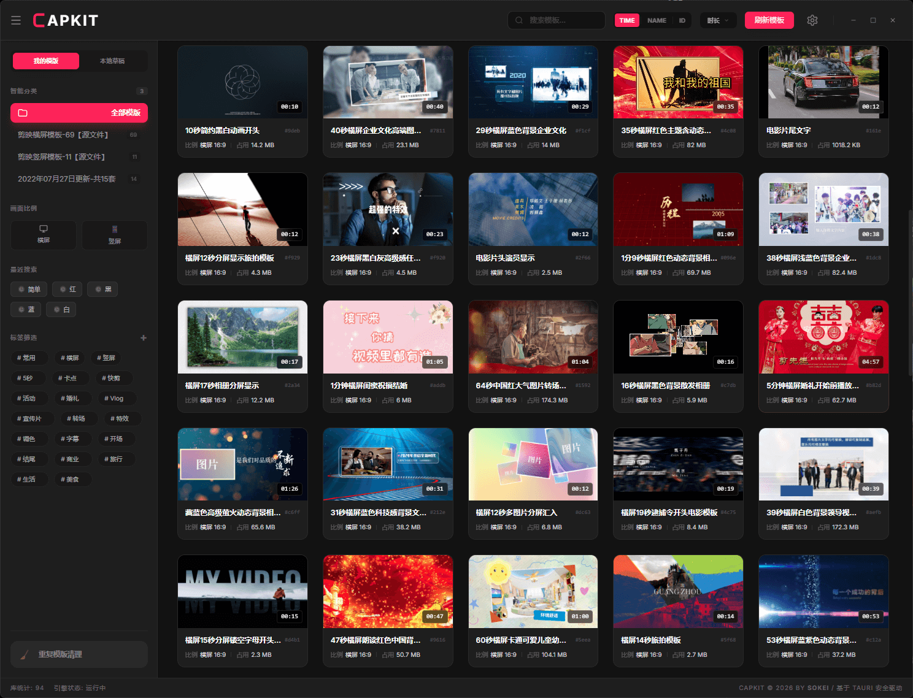

# CapKit - 极简剪映模板管理工具

**极致轻量 · 纯净高效 · 一个更懂创作者的单文件剪映伴侣**

---

## 📖 简介

CapKit 是一款专为剪映专业版用户设计的**模板管理小助手**。

作者本身是剪辑佬，深知本地模板文件夹堆积如山的烦恼，因此开发了这个仅 10MB 大小的单文件工具，帮你快速理清素材，一键同步草稿。它不是什么沉重的专业大作，而是一个随手即用的效率补丁。

## ✨ 核心特性

- **📂 本地目录管理**：自定义添加扫描目录，按时长、画面比例筛选你的本地模板。
- **⚡ 10MB 极轻量**：单文件 EXE，绿色免安装，即点即用。
- **� 一键导入模板**：选中模板可一键同步至剪映，实时生效，无需重启剪映。
- **🧹 重复模板查杀**：智能识别相同模板，帮您清理冗余，节省宝贵磁盘空间。
- **✨ 原生交互感**：延续剪映沉浸式深色模式，流畅动效，极致操作手感。

## 🚀 快速开始

1. **下载**：获取 `CapKit 0.1.*.exe` 可执行文件。
2. **运行**：双击即可启动（绿色免安装）。
3. **设置**：点击右上角“设置”图标，添加您的模板存储位置。
4. **使用**：选中模板后点击“一键安装”即可马上同步到剪映草稿。

## ⚠️ 注意事项

- **备份第一**：使用“重复清理”功能前，请务必手动备份重要模板。
- **免责声明**：本程序基于元数据检测，可能存在极小概率识别误差。物理删除文件属于高危操作，请谨慎执行。
- **版本要求**：支持剪映专业版最新环境。

## � 常见问题

**Q: 为什么提示没有模板？**  
A: 请确保在设置中正确添加了包含剪映模板（通常包含 `draft_content.json`）的父文件夹。

**Q: 为什么部分草稿无法编辑？**  
A: 剪映部分旧版或加密草稿目前仅支持查看，CapKit 坚持纯净修改原则，不会暴力破解您的加密数据。

## 📄 许可证

本项目目前为私有工具，作者保留所有权利。

---

**CapKit © 2026 Developed By [SOKEI](https://sokei.top)**

极致轻量，回归创作。

