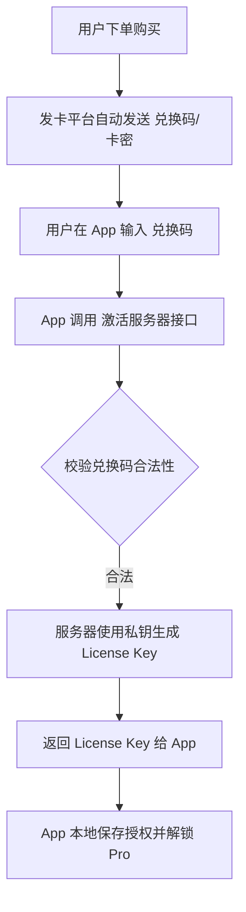

# CapKit Pro 自动发货方案建议书

## 1. 核心挑战
目前的授权机制是基于 **Ed25519 算法对机器码进行私钥签名**。这意味着：
- **License Key 必须根据用户的 Machine ID 实时生成**。
- 而发卡平台（如自动发货机器人、卡网）通常只能销售**预先生成的静态字符串**（卡密）。

## 2. 推荐方案：中转激活架构
为了实现自动发货，建议引入一个简单的“激活中转”流程：

### 流程示意图

### 关键组件说明
1.  **卡密系统 (Redeem Codes)**：
    - 您可以预先生成 1000 个随机 UUID（如 `CK-XXXX-XXXX`）上传到发卡平台。
    - 这些卡密不包含授权逻辑，仅作为“购买凭证”。
2.  **激活服务器 (Activation Server)**：
    - 一个微型后端（如 Node.js, Python Flask 或 Go）。
    - **核心逻辑**：接口接收 `redeem_code` + `machine_id`。
    - **安全性**：将 `PRIVATE_KEY_BYTES` 保存在服务器环境变量中，**不要**放在客户端代码。
    - **绑定逻辑**：服务器数据库记录哪个 `redeem_code` 绑定了哪个 `machine_id`，防止一码多用。

## 3. 快速落地建议 (针对开发者)

### 方案 A：使用第三方“网络验证”系统 (最快)
如果您不想自己维护服务器，国内有很多现成的“网络验证”发卡台（如：**阿目、易语言各类云验证转接**）：
- **优点**：自带发卡、防破、自动绑定机器码、黑名单管理。
- **缺点**：可能需要支付一点点手续费。

### 方案 B：自建极简后端 (最安全)
- **技术栈**：Vercel + Supabase (免费额度大) 或 便宜的云服务器 + FastAPI。
- **发卡渠道**：使用 **发卡台 (faka.run)** 或 **面包多 (mianbaoduo.com)**。
  - 用户在面包多购买后，您配置自动回复，引导用户前往您的激活网页或直接在 App 内激活。

## 4. 当前代码调整建议
如果采用上述方案，您的 `App.vue` 激活逻辑需要做如下调整：
1.  **输入框**：支持用户输入“卡密”而不是直接输入“License Key”。
2.  **API调用**：App 通过 `fetch` 请求您的服务器，获取最终的签名密钥。
3.  **持久化**：App 拿到服务器返回的 Long Key 后，存入 `localStorage` 或配置文件，之后仍可离线校验。

---
> [!TIP]
> **私钥安全提示**：实现自动发货后，请务必从本地 `license_gen.py` 中移除私钥并将该脚本从分发包中剔除，私钥仅由您的服务器持有。
